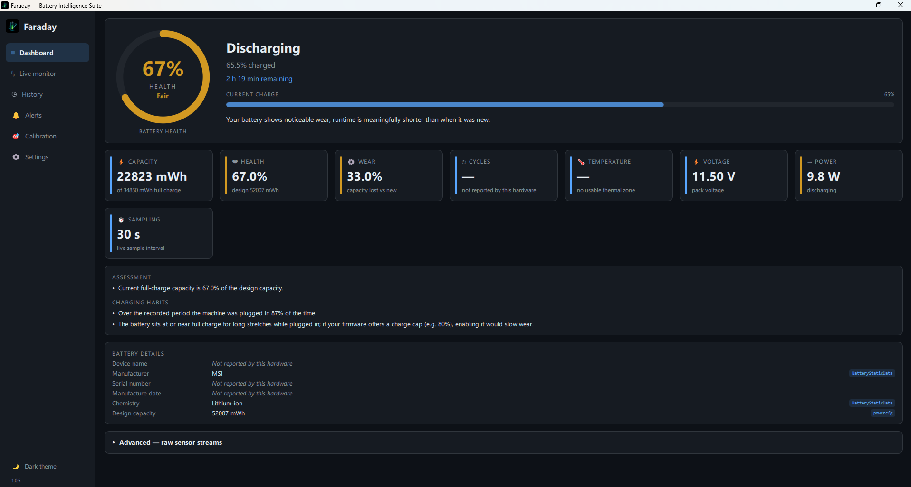
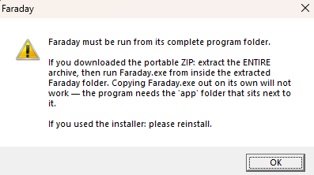
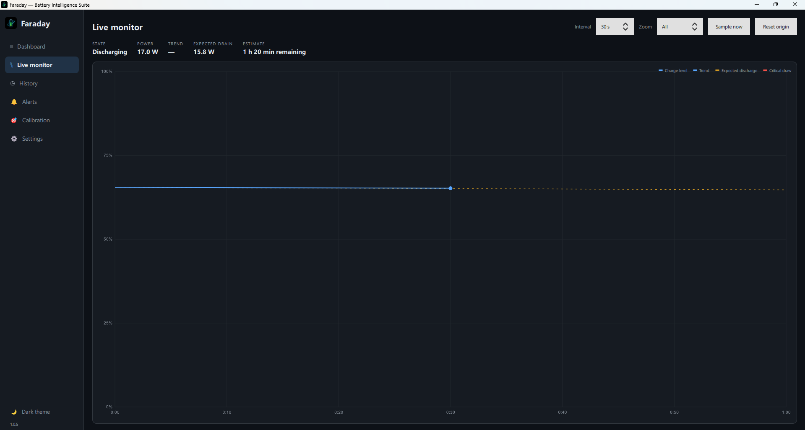
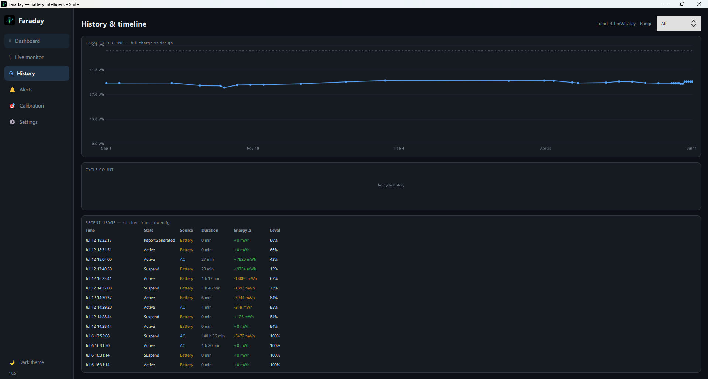

# Faraday — Battery Intelligence Suite

Windows tells you your battery is at 65 %. Faraday tells you it has permanently lost a third of the capacity it shipped with, projects when it will fall below its service threshold, and points out the charging habits that accelerate that decline — in plain language. It reads real firmware telemetry through public read-only Windows interfaces (WMI, `powercfg`, ACPI): no drivers, no elevation, no network, no telemetry.

The built-in `powercfg /batteryreport` gives you a static HTML dump of numbers. Faraday gives you a **health verdict**, a **degradation curve with an end-of-life estimate**, **charging-habit insights**, a **longitudinal timeline**, and live monitoring — and it is scrupulously honest about what your hardware does not report.

[](LICENSE)




**This is a real, genuinely worn battery on real hardware** — an MSI laptop whose pack has permanently lost 33 % of its original capacity (22,823 mWh remaining of a 52,007 mWh design). The ring is amber and the grade is "Fair" because the numbers say so.

Look at the fields marked **"Not reported by this hardware"**: cycle count, serial number, manufacture date, temperature. This laptop's firmware genuinely does not expose them — so Faraday says so. It does not print a zero, it does not guess, and it does not let a missing value leak into the health verdict. Most battery tools would render that absent cycle count as "0 cycles" and then cheerfully tell you the battery is "still early in its life" — directly contradicting the 33 % wear shown right above it. Faraday is built so that class of contradiction is structurally impossible. **The honesty is the feature.**

---

## Download

Requires **Windows 10/11 (x64)**.

### Portable ZIP — recommended

**[`Faraday-1.0.5-portable-win64.zip`](https://github.com/HARIHARAN-EKS/faraday-battery/releases/tag/v1.0.5)** — no installer, no admin rights, nothing written outside its own folder. **0 detections on VirusTotal**, whole archive and every file inside it.

```
SHA-256  f81074358f0d64c2312e120c5ae598af297ebdfd51dce785e305e8971d3029fe
```

### Installer — alternative

**[`Faraday-1.0.5-setup-win64.exe`](https://github.com/HARIHARAN-EKS/faraday-battery/releases/tag/v1.0.5)** — per-user install, never elevates, clean uninstaller.

```
SHA-256  8007b30a8a3f0eac779aa2df6ed5dcf7a751f437bbe030b47afd2e6888ee7a2d
```

Verify any download with `Get-FileHash <file>` before running it.

### How to run

**Extract the ENTIRE folder, then run `Faraday.exe` from inside it.** That is the only thing to click.

```
Faraday\
  Faraday.exe     <- run this
  README.txt
  app\            <- the program's runtime; not meant to be opened
  data\           <- your settings and battery history (created on first run)
```

To uninstall the portable version, delete the folder.

`Faraday.exe` is a small launcher; the application itself lives in `app\`. If you copy it out on its own — or only half-extract the ZIP — it cannot work. So instead of the raw Windows loader error that would normally follow, you get this:



That dialog is a deliberate design decision, not an apology. A Qt application's DLLs are resolved by the Windows *loader* before any of its code runs, so a bare exe would normally die with `The code execution cannot proceed because Qt6Gui.dll was not found` — a message that tells the user nothing. Faraday ships a tiny launcher that verifies its runtime first, so **every** failure mode — missing files, a corrupted DLL, a half-extracted archive — ends in an explanation instead of a system error. It is verified by a test suite that deletes each of the 129 runtime files in turn and asserts that not one of them produces a loader dialog.

---

## Antivirus — honest and up front

Faraday is **unsigned**, because a code-signing certificate costs money this project does not have. That has a measurable cost, and here it is (VirusTotal, 2026-07-12):

| File | Result | Flagged by |
|---|---|---|
| **`faraday-core.exe`** — the actual application | **0 detections** | — |
| **Portable ZIP** — the recommended download | **0 detections** | — (every bundled file 0/N) |
| `Faraday.exe` — the launcher stub | 1 / 70 | Arctic Wolf: `Unsafe` |
| `Faraday-1.0.5-setup-win64.exe` — the installer | 2 / 69 | Elastic: `Malicious (high Confidence)`; Trapmine: `Suspicious.low.ml.score` |

**Every engine that flags a wrapper clears its contents.** Arctic Wolf reports the application the launcher starts as clean. Elastic and Trapmine report every single file the installer writes to disk — and the identical payload delivered as a ZIP — as clean. All three labels are generic ML/heuristic scores; not one names a malware family.

Why the wrappers score at all: the launcher is a tiny (130 KB), statically linked binary that starts a child process — the silhouette ML models associate with droppers, even though its entire job is to check the runtime is present and then run it. VirusTotal's own sandbox trace of it records **"Network comms: NOT FOUND"**, no dropped files, no persistence, no registry writes.

**If your AV objects, use the portable ZIP** — it has no installer stub and scans clean end to end.

- [Application `faraday-core.exe` — 0 detections](https://www.virustotal.com/gui/file/f92311e9c60f98a2b9128a2f2b5984e184a97cb4a612f379a1a815af339dae7b)
- [Portable ZIP — 0 detections](https://www.virustotal.com/gui/file/f81074358f0d64c2312e120c5ae598af297ebdfd51dce785e305e8971d3029fe)
- [Launcher `Faraday.exe`](https://www.virustotal.com/gui/file/a3f6ca32a3889e91842bec8fd8878d1aa8873061b42314852cadc82dbd75f9d1)
- [Installer](https://www.virustotal.com/gui/file/8007b30a8a3f0eac779aa2df6ed5dcf7a751f437bbe030b47afd2e6888ee7a2d)

The scan reports themselves are in [`VirusTotal/3/`](VirusTotal/3), the analysis in [`docs/VIRUSTOTAL_BASELINE.md`](docs/VIRUSTOTAL_BASELINE.md), and ready-to-send false-positive reports for each vendor in [`docs/FP_SUBMISSIONS/`](docs/FP_SUBMISSIONS). The hardening is documented and verifiable: no packing, no obfuscation, zero network code, `asInvoker` manifest, no registry writes by the application, read-only hardware access.

---

## Features

### Live monitor



Real-time charge graph with an **extrapolated trend line** (least-squares fit over the session's own samples) and an **expected-discharge line** derived from your machine's usage history — so you can see immediately whether this session is draining faster than normal. Critical-draw spikes are marked. Interval, zoom and session origin are all adjustable.

### History and degradation



The **capacity-decline curve** (full-charge capacity against the design capacity, stitched from the firmware's own weekly records), a cycle chart, and the usage log. The trend readout here is 4.1 mWh/day of permanent loss. Note the cycle panel reads *"No cycle history"* — this firmware does not track cycles, and Faraday says so rather than plotting a line of zeros.

### Everything else

- **Dashboard** — health ring, metric cards, a plain-language verdict, charging-habit insights, and a per-field source breakdown showing which WMI class or powercfg field each value came from.
- **Alerts** — latched thresholds (low battery, high temperature, low voltage) with hysteresis, unplug-at-full and charge-below reminders, tray notifications, minimize-to-tray, opt-in autostart via a Startup-folder shortcut (never a registry Run key).
- **Calibration** — fuel-gauge drift detection and a guided 4-step conditioning workflow (charge → rest → discharge → recharge).
- **Reports** — CSV and JSON exports, plus a self-contained HTML health report with an inline SVG chart.
- **Settings** — dark/light themes, °C/°F, mWh/Wh, sample interval, data-folder access, i18n scaffold.
- **Advanced raw-sensor drawer** — every raw value Faraday read, with its source class, and an explicit list of what your hardware does *not* report.

If your machine has no battery thermal sensor (most consumer laptops don't), the temperature is labeled a system-zone **estimate** and the temperature alert is disabled with the reason given — rather than firing against a number that isn't your battery's.

---

## Metrics and where they come from

| Metric | Source | Measured or derived |
|---|---|---|
| Design capacity | `powercfg /batteryreport` → `BatteryStaticData` (ROOT\WMI) → `Win32_PortableBattery` | measured (precedence chain; powercfg wins) |
| Full-charge capacity | `BatteryFullChargedCapacity` (ROOT\WMI) → powercfg | measured |
| Remaining capacity | `BatteryStatus` (ROOT\WMI) | measured |
| **Health %** | — | **derived**: `100 × full-charge / design` |
| **Wear %** | — | **derived**: `100 − health` |
| **Charge %** | `BatteryStatus`; falls back to `Win32_Battery.EstimatedChargeRemaining` | derived (coulometric) / measured (fallback) |
| Charge & discharge rate (mW) | `BatteryStatus` | measured |
| **Net power (W)** | — | **derived**: `(charge − discharge) / 1000` |
| Voltage | `BatteryStatus` (zero treated as a firmware stub) | measured |
| Cycle count | `BatteryCycleCount` (ROOT\WMI) → powercfg (**zero = "not reported"**) | measured |
| Firmware runtime estimate | `BatteryRuntime` (`0xFFFFFFFF` sentinel filtered) | measured |
| **Time to full / empty** | — | **derived** from current rates, capped at 7 days |
| **Time to empty (trend)** | — | **derived**: least-squares fit over the session's samples |
| Temperature | `MsAcpi_ThermalZoneTemperature` (ACPI, via WMI); stub zones filtered | measured — a `*BAT*` zone is a true sensor, otherwise a labeled **system estimate** |
| Chemistry / manufacturer / serial | `BatteryStaticData` → powercfg → `Win32_Battery` / `Win32_PortableBattery` | measured |
| Capacity history | `powercfg /batteryreport` weekly buckets | measured |
| **Degradation curve** | — | **derived**: regression of capacity history (mWh/day) |
| **End-of-life projection** | — | **derived**: date the fit crosses 80 % of design |
| **Calibration drift** | — | **derived**: reported % − coulometric % |
| **Per-state drain** | powercfg usage log | **derived**: mean mW per state (Active / Suspend / …) |
| Status / AC state | `BatteryStatus` flags → `Win32_Battery.BatteryStatus` enum | measured |

Full detail, including the absent-vs-zero policy for every field: [`docs/METRICS.md`](docs/METRICS.md) and [`docs/DATA_SOURCES.md`](docs/DATA_SOURCES.md).

---

## Build from source

**Toolchain:** Qt 6.5+ (Quick, Controls, Sql, Widgets, LinguistTools), CMake ≥ 3.21, Ninja, MinGW-w64 (or MSVC), NSIS 3.x for the installer.

```powershell
# One-time setup (free tooling; no Qt account needed)
winget install Kitware.CMake Ninja-build.Ninja NSIS.NSIS Python.Python.3.12
python -m pip install aqtinstall
python -m aqt install-qt   windows desktop 6.8.2 win64_mingw -O C:\Qt
python -m aqt install-tool windows desktop tools_mingw1310    -O C:\Qt

# Build and run the full test suite
powershell -ExecutionPolicy Bypass -File build.ps1 -Test

# Package the shipped folder tree, the portable ZIP and the installer
powershell -ExecutionPolicy Bypass -File package.ps1 -Zip -Installer
```

MSVC works too (`/W4 /WX` is configured for it). Warnings are errors on both toolchains. Details: [`docs/BUILD.md`](docs/BUILD.md).

---

## Testing

- **26 test suites / 3751 real test cases**, all green — including ~1,800 property-based and boundary cases with invariant gates, and ~1,600 fuzz cases.
- **Fuzzing**: the powercfg XML parser (byte mutations, truncations, XXE and entity-bomb attempts — both inert, 5 MB reports), the WMI row layer (wrong types, garbage, partial rows), the settings loader, and the SQLite layer (corrupt, read-only, locked, missing). Zero crashes, zero hangs.
- **4-hour soak** at the default interval: no crashes, no memory leak (asymptotic plateau), exact 30 s sampling cadence, `PRAGMA integrity_check = ok`.
- **20 hard-kill/restart cycles mid-write**: zero database corruptions.
- **Launcher negative matrix**: bare exe, every one of the 129 runtime files deleted in turn, missing plugin/QML folders, truncated DLL, wrong working directory, Explorer extraction, USB drive — no path produces a raw Windows loader error.
- **Coverage**: 86 % line, 54 % branch over `src/`.
- **Cost to your battery**: 0.42 % of one CPU core at the default interval — the app's own draw is below the pack gauge's noise floor.

Records: [`tests/COVERAGE_MAP.md`](tests/COVERAGE_MAP.md), [`tests/PERF_RESULTS.md`](tests/PERF_RESULTS.md), [`docs/RELIABILITY_RESULTS.md`](docs/RELIABILITY_RESULTS.md), [`docs/SECURITY_AUDIT.md`](docs/SECURITY_AUDIT.md).

---

## Known limitations

Faraday has been field-tested on two real laptops (an HP, and the MSI with the worn battery shown above). These paths are implemented and unit-tested but **have never run on real hardware**, because I do not have access to it:

- **Lenovo firmware charge-cap** (the `Lenovo_BiosSetting` probe and its UI section) — no Lenovo machine tested. On all other hardware the section is correctly hidden.
- **A true `*BAT*` battery thermal sensor** — 0 of 2 field machines expose one, so the battery-sensor path and the live temperature alert have never fired in the field.
- **Multi-pack systems** (2+ batteries) — aggregation is unit-tested with synthetic packs only.
- **Genuinely high-cycle packs (500+)** and the accuracy of the end-of-life projection over months of real history.
- **A desktop or VM with no battery** — the no-battery screen is unit-tested, not field-run.

Reports from any of these configurations are welcome — see [`docs/FIELD_TESTING.md`](docs/FIELD_TESTING.md).

---

## License and author

**MIT** — see [`LICENSE`](LICENSE). Built with Qt 6 (LGPLv3, dynamically linked) and SQLite (public domain).

Created by **E K S Hariharan**.
